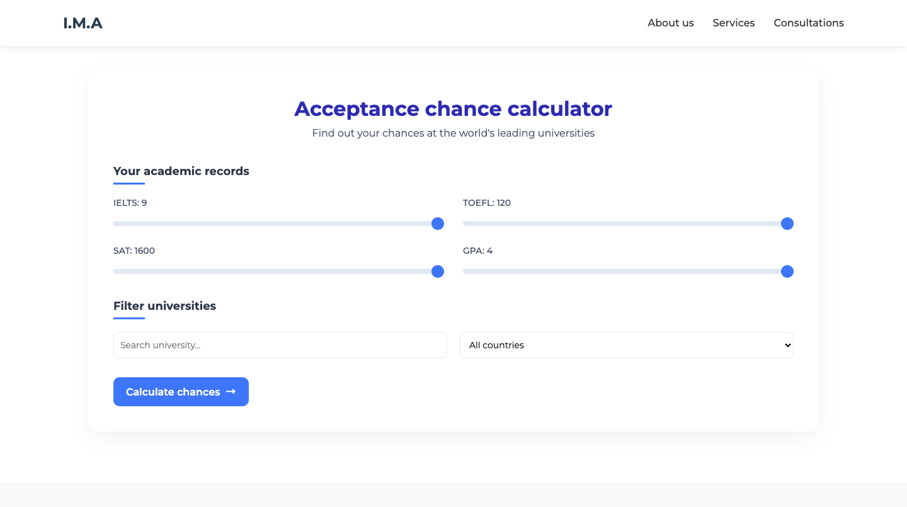
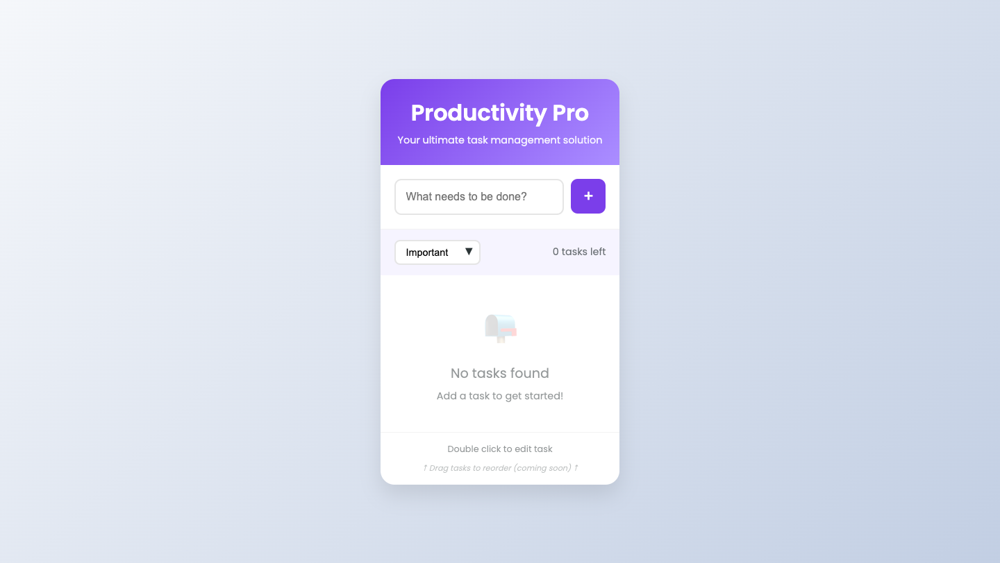
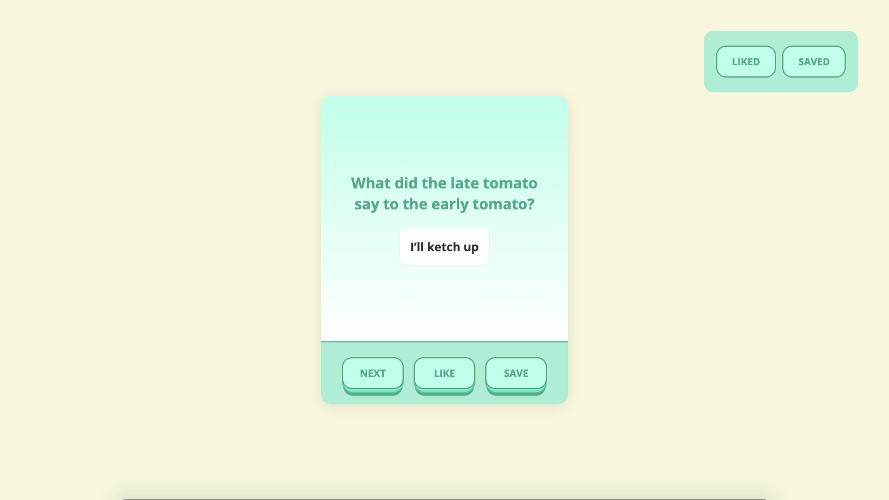

# 👋 Hello, I'm Marlen

> Frontend Developer & Creative Problem Solver

Welcome to my digital garden - a space where I showcase my passion for creating beautiful, functional web experiences.

## 🎭 My Story

From writing my first "Hello World" to building complex web applications, my journey in development has been fueled by curiosity and a love for creating things that live on the internet.

## 💡 What I Believe In

- **Clean Code** is maintainable code
- **User Experience** should be intuitive and delightful  
- **Continuous Learning** is essential in tech
- **Open Source** makes us better developers

## 🛠 My Toolbox

### Frontend Mastery
- React, TypeScript, JavaScript (ES6+)
- HTML5, CSS3, SCSS, Styled Components
- Responsive Design, CSS Grid, Flexbox

### Development Tools
- Git, GitHub, Vite, Webpack
- VS Code, Chrome DevTools
- Figma, Adobe Creative Suite

## 🌟 Featured Work

### Admission Chance Calculator
<<<<<<< HEAD

### ToDo App

### Password Manager

### Joke App

=======

## 📬 Let's Build Something Amazing

I'm currently available for freelance projects and full-time opportunities. Let's discuss how we can work together to bring your ideas to life!

**Get in touch:**
- 📧 Email: [Connect with me through email](mambalxd@gmail.com)
- 💼 LinkedIn: [Connect with me](https://www.linkedin.com/in/marlen-istambaev-944367350?utm_source=share&utm_campaign=share_via&utm_content=profile&utm_medium=ios_app)
- 🐙 GitHub: [Check my code](https://github.com/MambaXan)

---

*"The web is what you make of it" - let's make something beautiful together.*